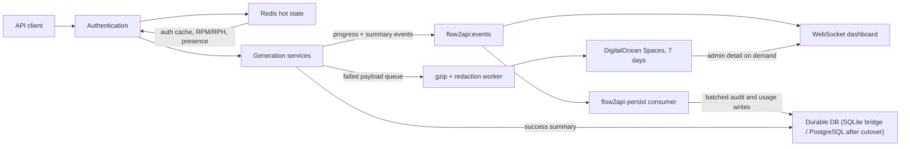

# Redis performance rollout

During the PostgreSQL bridge, Flow2API can use SQLite or PostgreSQL for durable relational data. Redis remains responsible only for short-lived hot state, atomic limits, progress, maintenance coordination, events, and queued persistence. PostgreSQL cutover is documented separately in `postgres-migration-runbook.md`.

> Do not enable required mode or retention before Redis has a valid state marker and a verified pre-change Google Drive backup exists. Run only one Flow2API replica; browser profiles and runtime coordination remain local.

## Quick start

Deploy the code in shadow mode first:

```bash
FLOW2API_REDIS_URL="${{Redis.REDIS_URL}}"
FLOW2API_REDIS_MODE=shadow
FLOW2API_RETENTION_ENABLED=false
FLOW2API_DEBUG_ENABLED=false
FLOW2API_DEBUG_PAYLOAD_LOGGING=false
```

Initialize a new Redis service explicitly from a Railway shell:

```bash
python -m src.scripts.redis_state init
python -m src.scripts.redis_state status
```

The application never creates a missing marker during startup. A missing or mismatched marker keeps Redis unavailable so a lost Redis volume cannot silently reset rate limits.

## Provision Railway Redis

Create a Redis 7 service in the same Railway project and production environment as Flow2API. Use private networking and attach a persistent volume at `/data`. Railway's template may provision a newer major release; pin the service source to `redis:7-alpine` before required mode. The production service currently resolves that tag to Redis 7.4.x.

Configure the Redis server with:

```text
--appendonly yes --appendfsync everysec --maxmemory 384mb --maxmemory-policy noeviction
```

Set these flags in the durable Railway start command, not only through `CONFIG SET`; the template starts Redis without a writable config file, so `CONFIG REWRITE` cannot preserve live-only changes. A password-protected command is:

```bash
redis-server --dir /data --appendonly yes --appendfsync everysec --maxmemory 384mb --maxmemory-policy noeviction --requirepass "$REDIS_PASSWORD"
```

Allocate 512 MB RAM. In Railway, set the Flow2API reference variable exactly as:

```text
FLOW2API_REDIS_URL=${{Redis.REDIS_URL}}
```

On the Railway Hobby plan, scheduled Railway volume backups are unavailable. Keep AOF enabled, retain the fail-closed state marker, and use the documented PostgreSQL/Google Drive backup path for durable relational data. After provisioning, verify the effective Redis runtime configuration:

```bash
redis-cli -u "$FLOW2API_REDIS_URL" CONFIG GET appendonly
redis-cli -u "$FLOW2API_REDIS_URL" CONFIG GET appendfsync
redis-cli -u "$FLOW2API_REDIS_URL" CONFIG GET maxmemory
redis-cli -u "$FLOW2API_REDIS_URL" CONFIG GET maxmemory-policy
```

Expected values are `yes`, `everysec`, `402653184`, and `noeviction`.

Do not attempt to enable Railway backup schedules on Hobby. AOF improves Redis restart durability but is not an independent backup; the state marker deliberately keeps protected work unavailable after a lost/reset Redis volume until an operator explicitly restores or initializes it.

## Configure Flow2API

| Variable | Required | Default | Purpose |
| --- | --- | --- | --- |
| `FLOW2API_REDIS_URL` | For shadow/required | Empty | Railway private Redis URL |
| `FLOW2API_REDIS_MODE` | No | `shadow` when URL exists, otherwise `off` | `off`, `shadow`, or `required` rollout state |
| `FLOW2API_SQLITE_READ_POOL_SIZE` | No | `3` | WAL-aware persistent read connections |
| `FLOW2API_RETENTION_ENABLED` | No | `false` | Enables bounded seven-day cleanup after maintenance |
| `FLOW2API_FAILED_LOG_PREFIX` | No | `flow2api/logs` | Private Spaces prefix for compressed failures |
| `FLOW2API_FAILED_LOG_QUEUE_SIZE` | No | `100` | Bounded asynchronous payload queue |
| `FLOW2API_FAILED_LOG_PENDING_MAX_BYTES` | No | `67108864` | Bounded in-flight payload memory |
| `FLOW2API_DEBUG_PAYLOAD_LOGGING` | No | Disabled on Railway | Opt-in request/response diagnostics |
| `FLOW2API_SYNC_DEBUG_LOGGING` | No | `false` | Emergency opt-in synchronous logging |

Modes behave as follows:

- `off`: existing SQLite/in-process behavior remains available for local development.
- `shadow`: SQLite and current in-process limits remain authoritative while Redis caches, counters, and events are mirrored.
- `required`: Redis is authoritative for new protected work. If unavailable, submissions receive HTTP 503 with `{"detail":"redis_unavailable"}` and `Retry-After: 5`.

Health, metrics, admin reads, and existing-job polling remain available when Redis is down.

## Understand the data flow



Redis keys use these lifetimes:

| Data | Key or stream | Lifetime |
| --- | --- | --- |
| Auth and assignment cache | `flow2api:auth:*` | 60 seconds, immediate admin invalidation |
| Rate configuration | `flow2api:rate-config:*` | 60 seconds |
| RPM/RPH counters | `flow2api:rate:*` | Current minute/hour plus five seconds |
| Presence | `flow2api:presence:*` | 120 seconds |
| Progress | `flow2api:progress:*` | Refreshed during work; 24 hours after the last update |
| Events | `flow2api:events` | Approximate maximum 100,000 entries |

## Verify shadow mode

Run one normal traffic cycle before switching modes. Check:

```bash
curl -fsS https://YOUR_ADMIN_HOST/health
curl -fsS https://YOUR_ADMIN_HOST/metrics | grep -E 'redis|event_consumer|sqlite_writer|event_loop|websocket|payload'
```

`redis_ready`, Redis `state_warmed`, and `event_consumer_ready` must all be true. Redis backlog must return to zero, and rate decisions in application logs must match the current in-process decisions.

Open the Request logs dashboard and confirm that new rows and progress arrive without two-second REST polling. Disconnect/reconnect the browser and confirm the last stream cursor is replayed.

Run the five-minute, 50-connection control-plane benchmark from a host near the origin and again from Pakistan/Asia:

```bash
python -m src.scripts.load_control_plane \
  --base-url https://YOUR_HOST \
  --path /health \
  --duration 300 \
  --concurrency 50 \
  --target-p95-ms 100
```

For protected generation, point the staging upstream configuration at the approved mock, pass a JSON body with `--body`, add `--method POST --bearer "$FLOW2API_TEST_KEY"`, and set the expected status. Never run a generation load test against the live upstream.

## Enter required mode

After shadow verification:

```text
FLOW2API_REDIS_MODE=required
```

Redeploy and validate the outage policy in staging by temporarily stopping Redis:

- New protected generation/submission returns 503 and `Retry-After: 5`.
- `/health`, `/metrics`, admin log history, and `GET /v1/jobs/{job_id}` still respond.
- Connected admin event sockets close with WebSocket code 1013.
- Restoring Redis with the state marker allows new work without resetting counters.

## Run the maintenance window

Stop the Flow2API service before running compaction. The command creates and verifies a Google Drive `pre-change-7d` backup first, applies cleanup in batches of 500, checks protected row counts and foreign keys, runs `VACUUM INTO`, verifies the compact file, and atomically swaps it into place.

```bash
python -m src.scripts.compact_sqlite \
  --database /app/storage/data/flow.db \
  --days 7 \
  --confirm COMPACT
```

The tool aborts if Google Drive is disconnected, the backup fails, free volume space is insufficient, integrity fails, foreign keys fail, or protected row counts change. The previous local database is removed only after the remote backup and compact replacement have both been verified. Pre-change Drive backups are tagged with a seven-day expiry and the running backup scheduler removes expired rollback backups.

After the command succeeds:

1. Create and verify an encrypted Google Drive pre-change database backup.
2. Set `FLOW2API_RETENTION_ENABLED=true`.
3. Restart one replica and inspect `/health`.
4. Run smoke/load checks before reopening submissions.

Retention never removes queued or active GeminiGen tasks. It deletes terminal GeminiGen rows, request summaries, API-key audits, Redis persistence markers, and failed payload objects older than seven days. Existing large SQLite request/response bodies in the latest seven days are reduced to summaries and historical full bodies are not archived.

## Benchmark Southeast Asia staging

Keep SFO production unchanged while staging runs in a Southeast Asia Railway region. Use identical environment settings and one replica. Compare:

- origin control-plane p95 below 100 ms;
- Pakistan/Asia external control-plane p95 below 350 ms;
- WebSocket progress delivery below 500 ms;
- SQLite bridge writer-wait p95 below 20 ms, or PostgreSQL pool-wait p95 below 10 ms after cutover;
- Redis persistence backlog drains within five seconds;
- Google connectivity, captcha/browser behavior, cache delivery, and WebSocket replay.

Move production only after a fresh volume backup and manual upstream/browser validation.

## Troubleshoot failures

| Symptom | Meaning | Action |
| --- | --- | --- |
| `redis_state_marker_missing` | Redis is new, flushed, or restored incorrectly | Restore the expected volume or explicitly run `redis_state init` after review |
| 503 `redis_unavailable` | Required-mode safety gate is active | Restore Redis; do not switch modes just to bypass limits |
| WebSocket code 1013 | Event feed lost Redis | Dashboard falls back to REST history; restore Redis |
| `payload_storage_error` | Spaces upload/read failed | The user request is unaffected; verify Spaces credentials and queue metrics |
| Increasing Redis backlog | Durable persistence consumer is not draining | Check `event_consumer_ready`, database pool/writer waits, capacity, and Redis errors |
| `noeviction` write error | Redis reached its 384 MB data limit | Inspect stream/key growth and increase capacity; do not enable eviction |

## Why this change exists

| Evidence | Finding | Implemented path |
| --- | --- | --- |
| Managed authentication performed repeated SQLite reads and synchronous usage/audit writes | Control-plane requests contended on one SQLite writer | 60-second Redis caches plus batched stream persistence |
| Request logs averaged hundreds of kilobytes and full bodies were searched with `%LIKE%` | SQLite grew to gigabytes and searches scanned payloads | 1 KB summary fields, summary-only search, failure payloads in Spaces |
| Dashboard requested log history every two seconds | Repeated reads continued even when nothing changed | Cookie-authenticated WebSocket events with replay/resync |
| `wget`, `curl`, filesystem scans, and file logging ran synchronously | Long operations blocked the event loop | Worker threads, bounded logging/payload queues, and lag metrics |
| Cloudflare/Railway edge was in Singapore while the service was in SFO | Network geography dominated Pakistan control latency | Southeast Asia staging benchmark before production migration |
